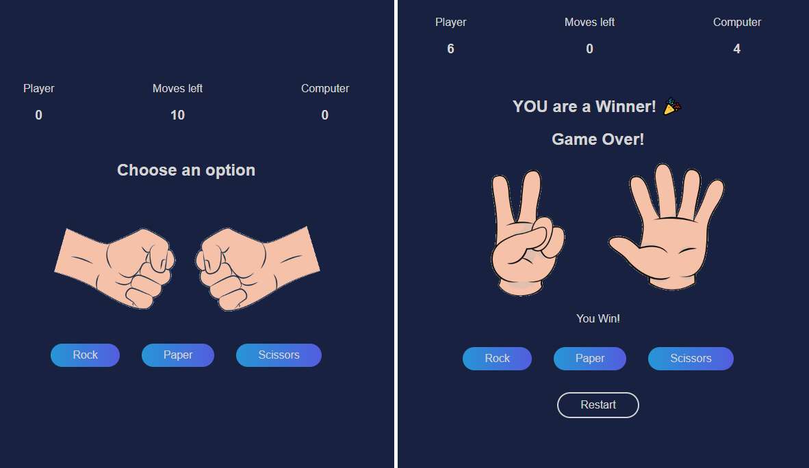

# Rock-Paper-Scissors Game
Playing against a computer that generates its choice randomly. At the start of the game, there are 10 moves set, which are counted down after each round. In case of a tie, the move is not counted, and the game continues.

To play the game, both the player and the computer simultaneously choose one of three options: "rock," "paper," or "scissors."

* Rock beats scissors
* Scissors beats paper
* Paper beats rock

After both the player and computer make their choices, the winner is determined based on the rules above. If the player wins, they earn one point, and if the computer wins, the point goes to the computer. The game continues until all 10 moves have been played.

---

